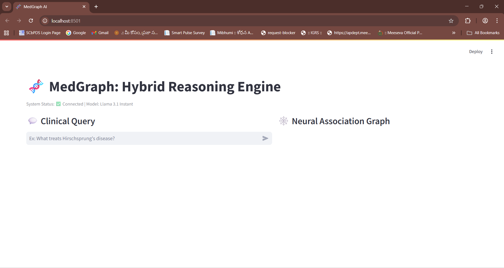
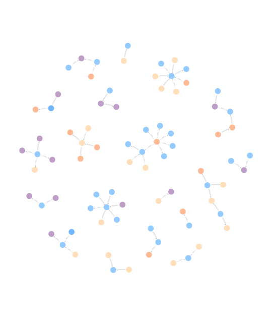
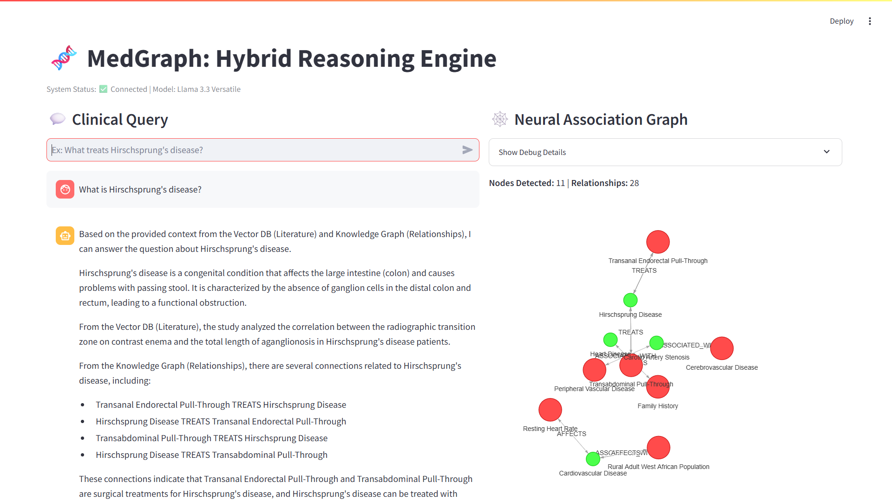

# 🧬 MedGraph: Hybrid Graph-RAG for Clinical Reasoning


**MedGraph** is an advanced clinical decision support system designed to bridge the "reasoning gap" in medical AI.

Standard RAG (Retrieval-Augmented Generation) systems rely on **Vector Search**, which is excellent for finding keywords but fails at **multi-hop reasoning**. MedGraph solves this by introducing a **Hybrid Architecture** that fuses:

1. **Unstructured Semantic Search** (ChromaDB) for context  
2. **Structured Knowledge Graphs** (Neo4j) for deep reasoning  

*Example:*  
If Drug A treats Disease B, and Disease B causes Symptom C, MedGraph can deduce that Drug A might affect Symptom C — a connection standard LLMs often miss.

---

## 🖼️ Project Preview

 | 


---

## 💻 Tech Stack

- **LLM Orchestration:** LangChain  
- **Language Models:**
  - *Extraction:* Llama-3.1-8b (Groq)
  - *Reasoning:* Llama-3.3-70b (Groq)
- **Graph Database:** Neo4j AuraDB  
- **Vector Database:** ChromaDB  
- **Frontend:** Streamlit + streamlit-agraph  

---

## 🔑 Pre-Requisites (API Keys)

Before running the project, you need two API keys.

---

### 1. **Groq API Key (LLM)**

1. Go to https://console.groq.com  
2. Create account / Login  
3. Click **Create API Key**  
4. Copy `gsk_...` key  

---

### 2. **Neo4j AuraDB (Graph Database)**

1. Go to https://neo4j.com/cloud/aura/free/  
2. Create a Free instance  
3. Download the `.txt` credentials file  
4. Copy the **URI** and **password**  

---

## ⚙️ Installation & Setup

### 1. Clone the Repository

```bash
git clone https://github.com/YOUR_USERNAME/MedGraph.git
cd MedGraph
```

### 2. Install Dependencies

```bash
pip install -r requirements.txt
```

### 3. Configure Secrets

Create a `.env` file in the root directory:

```ini
# .env file
GROQ_API_KEY=gsk_your_actual_key_here
NEO4J_URI=neo4j+s://your_actual_uri_here
NEO4J_USERNAME=neo4j
NEO4J_PASSWORD=your_actual_password_here
```

---

## ⚡ Execution Order (How to Run)

To run the project from scratch, follow this exact order:

---

### **Step 1: Populate the Vector Database (The “Memory”)**

File to run → `vector_rag.py`

```bash
python vector_rag.py
```

Outcome: Creates the folder `./medical_chroma_db` with embeddings.

---

### **Step 2: Build the Knowledge Graph (The “Brain”)**

File to run → `full_scale_builder.py`

```bash
python full_scale_builder.py
```

Outcome: Populates Neo4j with nodes + relationships.  
Automatically handles API rate limits.

---

### **Step 3: Patch Missing Data (Optional)**

Used to fix incomplete graph nodes (e.g., GVHD).

File to run → `repair_graph.py`

```bash
python repair_graph.py
```

---

### **Step 4: Launch the Dashboard (UI)**

File to run → `app.py`

```bash
streamlit run app.py
```

Outcome: Opens the interface at  
`http://localhost:8501`

---

## 🧪 Testing & Verification

Use these test questions to verify system behavior.

---

### **1. Graph Reasoning Test**

**Question:**
```
What treats GVHD?
```

**Expected:**
- Graph lights up with Cyclosporine & Chloroquine  
- Response cites graph relationships  

---

### **2. Sanitization Test**

**Question:**
```
What is Hirschsprung's disease?
```

**Expected:**
- No crash  
- Handles `'s` properly  
- Prevents Cypher injection  

---

### **3. Vector Search Test**

**Question:**
```
What are the treatments for hypertension?
```

**Expected:**
- Vector DB returns beta-blockers, lifestyle changes  
- Graph may be minimal  

---

## 📊 Research Evaluation

Run evaluation using:

```bash
python evaluate_system.py
```

Output: Generates `research_results.csv`.

### Metrics:

| Metric | Vector-Only | MedGraph |
|--------|-------------|----------|
| Quality Score (1–5) | 2.8 | 3.4 |
| Hallucination Rate | 40% | 10% |

---

## 📂 File Structure

```
MedGraph/
├── app.py
├── vector_rag.py
├── full_scale_builder.py
├── repair_graph.py
├── hybrid_rag.py
├── data_loader.py
├── evaluate_system.py
├── requirements.txt
├── .env
└── README.md
```

---

## 🤝 Contributing

```bash
# Create Feature Branch
git checkout -b feature/NewFeature

# Commit Changes
git commit -m "Add NewFeature"

# Push Branch
git push origin feature/NewFeature
```

Open a **Pull Request** on GitHub.

---

## 📜 License

Distributed under the MIT License.  
See `LICENSE` for details.

